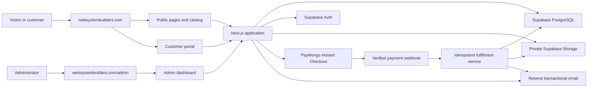
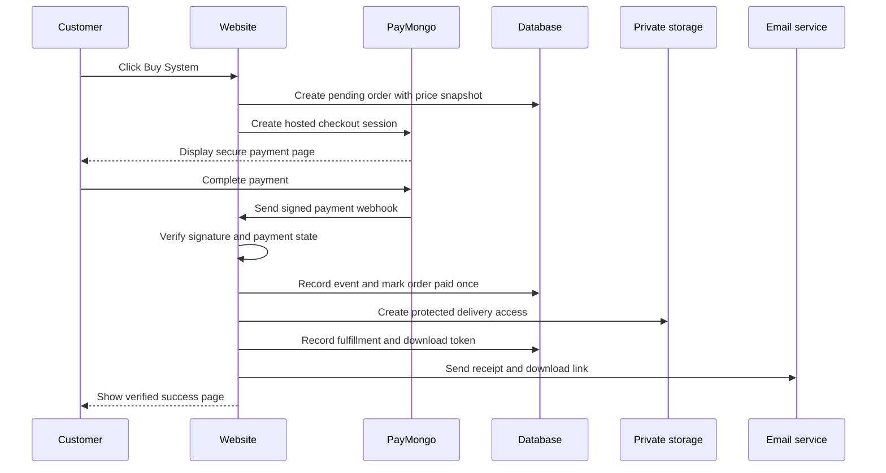

# WebSystemBuilders Website Blueprint

## Document purpose

This document is the main product, architecture, design, and delivery blueprint for `websystembuilders.com`. It is the source of truth for planning and implementation decisions unless a newer approved decision explicitly replaces part of it.

The platform will combine:

- A professional service website
- A catalog of ready-made systems
- Custom development services
- Secure digital-product checkout and delivery
- A customer portal
- An administrator-controlled content and commerce system
- A future path toward hosted SaaS subscriptions

## 1. Product vision

WebSystemBuilders will help two primary audiences find, evaluate, purchase, and request software systems from one trusted website.

### Students

Students may need:

- Capstone system development
- Thesis-related technical development support
- System templates
- UI/UX development
- Debugging and consultation
- Deployment assistance
- Documentation guidance
- Technical mentoring

Student services must be positioned as ethical technical support. The platform must not advertise academic dishonesty, deceptive authorship, guaranteed grades, or rule-breaking services.

### Business owners

Business owners may need:

- Point-of-sale systems
- Inventory systems
- Warehouse systems
- Payroll and attendance systems
- Booking systems
- Customer management systems
- School or enrollment systems
- Other management platforms
- Custom software development

## 2. Business model

The platform will support three product models.

| Model | Description | Initial release |
|---|---|---|
| Custom development | Requirements are reviewed and quoted before development | Yes |
| Ready-made systems | Customers buy an existing system or customizable template | Yes |
| Hosted SaaS | Customers subscribe to use selected systems online | Later |

The initial release should prioritize custom development and ready-made systems. Hosted SaaS subscriptions should be added only when a specific product has proven demand.

## 3. Product principles

1. **Trust before conversion.** Show real information, transparent inclusions, clear policies, and secure payment behavior.
2. **One coherent platform.** Public pages, catalog, checkout, customer access, and administration belong to one application.
3. **Admin-controlled content.** Systems displayed publicly must come from administrator-managed database records rather than hardcoded product cards.
4. **Verified payment before delivery.** A browser redirect never proves payment. Only verified server-side payment confirmation unlocks fulfillment.
5. **Private digital delivery.** ZIP files remain private and are delivered using expiring links.
6. **Simple first, extensible later.** Build a modular monolith before considering microservices.
7. **Professional visual restraint.** Use spacing, typography, hierarchy, and product imagery instead of excessive glow, shadows, and decoration.
8. **Accessible and responsive by default.** Primary journeys must work with keyboards, assistive technology, and common mobile widths.

## 4. Platform sectors

| Sector | Users | Responsibilities |
|---|---|---|
| Public website | Visitors | Brand, services, catalog, portfolio, trust, and inquiries |
| Checkout | Buyers | Collect customer details and open secure payment |
| Customer portal | Customers | Orders, downloads, updates, receipts, and support |
| Admin dashboard | Administrators | Systems, content, orders, payments, delivery, and settings |
| Automation layer | Server | Webhooks, fulfillment, signed links, and emails |

## 5. High-level architecture



### Architecture style

Use a modular monolith:

- One Next.js repository
- One deployable web application
- Clear internal modules for catalog, checkout, administration, delivery, and accounts
- Managed external services for database, authentication, storage, payment, and email
- No microservices in the initial release

## 6. Technology stack

| Area | Choice | Purpose |
|---|---|---|
| Framework | Next.js App Router | Public pages, portal, admin, server routes, and rendering |
| Language | TypeScript | Type-safe application code |
| UI | React | Interactive interfaces and reusable components |
| Styling | Tailwind CSS | Responsive design system implementation |
| Components | shadcn/ui foundation | Accessible primitives customized to the brand |
| Typography | Geist | Modern, neutral, professional typography |
| Database | Supabase PostgreSQL | Primary relational data store |
| Authentication | Supabase Auth | Customer and administrator identity |
| Storage | Supabase Storage | Private systems, media, and documents |
| Payments | PayMongo Hosted Checkout | Philippine payment methods and hosted payment UI |
| Email | Resend | Transactional purchase and inquiry email |
| Validation | Zod | Shared input and environment validation |
| Forms | React Hook Form | Complex user and administrator forms |
| Unit tests | Vitest | Business logic and utility tests |
| Browser tests | Playwright | Critical user-journey testing |
| Hosting | Vercel | Next.js deployment and preview environments |
| Source control | GitHub | Repository and development history |
| Analytics | Vercel Analytics initially | Traffic and performance visibility |
| Error monitoring | Sentry when production-ready | Application error reporting |

Provider choices may be revisited before production if account eligibility, fees, or regional availability do not meet business requirements. Business logic must be isolated behind provider modules so payment and email integrations can be replaced without rewriting the catalog or orders domain.

## 7. Information architecture

### Public routes

| Route | Purpose |
|---|---|
| `/` | Homepage and primary audience selection |
| `/for-students` | Student-focused systems and services |
| `/for-business` | Business-focused systems and services |
| `/systems` | Searchable and filterable systems catalog |
| `/systems/[slug]` | Individual system details and purchase entry point |
| `/services/custom-development` | Custom software service |
| `/portfolio` | Real project work and case studies |
| `/process` | Development and delivery process |
| `/about` | Company identity and credibility |
| `/contact` | Contact information and form |
| `/request-a-quote` | Detailed project inquiry |
| `/faq` | Common questions |
| `/legal/privacy` | Privacy policy |
| `/legal/terms` | Website and purchase terms |
| `/legal/refunds` | Refund policy |
| `/legal/delivery` | Digital delivery policy |
| `/legal/license` | Software license terms |

### Checkout and customer routes

| Route | Purpose |
|---|---|
| `/checkout/[systemSlug]` | Customer information and purchase confirmation |
| `/payment/success` | Verified payment outcome and delivery status |
| `/payment/cancelled` | Cancelled or incomplete checkout guidance |
| `/account` | Customer account overview |
| `/account/orders` | Order history |
| `/account/orders/[orderNumber]` | Order, receipt, and delivery details |
| `/account/downloads` | Available system downloads |
| `/account/support` | Support requests |

Customer accounts and the full customer portal are included in the initial launch. Guest checkout is permitted. A purchase is associated with the submitted email, but portal access requires verification of that same email through a secure sign-in or account-activation flow. Every order must have durable customer, payment, and delivery records.

### Admin routes

| Route | Purpose |
|---|---|
| `/admin` | Dashboard |
| `/admin/systems` | Systems list and filters |
| `/admin/systems/new` | Create a system |
| `/admin/systems/[id]` | Edit, preview, publish, or archive a system |
| `/admin/categories` | Categories and audience organization |
| `/admin/orders` | Orders and fulfillment |
| `/admin/customers` | Customer history |
| `/admin/inquiries` | Quote and contact inquiries |
| `/admin/content` | Portfolio, testimonials, FAQs, and page content |
| `/admin/media` | Media management |
| `/admin/settings` | Business and website settings |
| `/admin/audit-log` | Important administrator activity |

## 8. Frontend structure

```text
src/
├── app/
│   ├── (marketing)/
│   │   ├── page.tsx
│   │   ├── systems/
│   │   │   ├── page.tsx
│   │   │   └── [slug]/page.tsx
│   │   ├── for-students/
│   │   ├── for-business/
│   │   ├── services/
│   │   ├── portfolio/
│   │   ├── process/
│   │   ├── about/
│   │   ├── contact/
│   │   └── legal/
│   ├── (customer)/
│   │   └── account/
│   ├── checkout/
│   ├── payment/
│   ├── admin/
│   └── api/
│       ├── checkout/
│       ├── webhooks/paymongo/
│       ├── downloads/
│       └── email/
├── components/
│   ├── ui/
│   ├── layout/
│   ├── marketing/
│   ├── systems/
│   ├── checkout/
│   ├── customer/
│   └── admin/
├── features/
│   ├── catalog/
│   ├── orders/
│   ├── payments/
│   ├── delivery/
│   ├── inquiries/
│   └── content/
├── lib/
│   ├── supabase/
│   ├── paymongo/
│   ├── email/
│   ├── security/
│   └── validation/
├── emails/
├── hooks/
├── types/
└── styles/
```

Keep domain logic out of page components. Pages should compose features; payment, delivery, and authorization rules must remain in server-side domain modules.

## 9. System catalog model

Each system record must support:

- Name and slug
- Target audience: Student, Business, or Both
- Category
- Product type: ready-made, customizable template, SaaS, or custom service
- Short and full descriptions
- Feature list
- Cover image, screenshots, and optional video
- Demo URL and optional demo instructions
- Technology stack
- Pricing type: fixed, starting, subscription, or quotation
- Regular and optional sale price
- Currency
- Delivery estimate
- Package inclusions
- Support coverage
- License terms
- System requirements
- Version and last update
- Featured status
- SEO title and description
- Status: Draft, Published, Unlisted, or Archived

### Approved launch catalog structure

| Audience | Launch category or service |
|---|---|
| Business | Point of Sale |
| Business | Inventory Management |
| Business | Warehouse Management |
| Student | Capstone Systems |
| Student | Thesis-Related Systems |
| Both | Custom System Development |

Categories are administrator-managed database records. This approved starting structure does not prevent administrators from adding categories later.

### Pricing and currency localization

- Ready-made systems may use a fixed price or a visible starting price.
- Customizable systems may use a starting price with separately quoted changes.
- Custom development uses Request a Quote.
- Store every catalog price as an authoritative integer amount and ISO currency code.
- Use PHP as the canonical catalog currency and default settlement currency.
- Infer a visitor's likely display currency from coarse country information and allow manual override.
- Remember the selected display currency without storing precise location.
- Retrieve exchange rates server-side through a replaceable provider, cache them, and record the rate timestamp.
- Prefix converted displays with an approximation indicator and label them as estimates.
- Display the actual charge currency and final amount before payment.
- Preserve base price, exchange-rate context, displayed estimate, and actual charged amount and currency on the order.
- Never use a browser-calculated conversion as the authoritative checkout amount.

PayMongo supports the approved default PHP settlement model. USD card acceptance may be offered only after PayMongo enables it for the merchant account and only for eligible card payments. Other localized currencies are display estimates rather than charge currencies. If actual charging in additional currencies becomes required later, add a suitable international provider behind the existing payment abstraction.

### Approved commercial license direction

Ready-made systems include their source code and use a broad, perpetual, non-exclusive commercial license. The purchaser may use, copy, modify, deploy, resell, and redistribute the purchased system, including the original source package. WebSystemBuilders retains ownership of its original work, may continue selling and licensing the same system, and does not grant exclusivity, ownership of the WebSystemBuilders brand, or rights that override third-party licenses.

Product pages and purchase terms must clearly state:

- Source code is included.
- Resale and redistribution are allowed.
- The license is non-exclusive.
- WebSystemBuilders may continue selling the same system.
- Third-party packages, fonts, media, and services remain governed by their own licenses.
- Support, updates, warranties, liability, and trademark rights are separate from source-code permissions.

Before production, the final license text and every distributed dependency require appropriate legal and license-compliance review.

### Approved refund-policy direction

The owner's commercial intent is that completed digital-system sales are final and that customers do not receive discretionary refunds for change of mind. Public copy must not use an absolute “No Return, No Exchange/Refund” term that suggests legally required remedies are waived.

The production policy must preserve remedies required by applicable law for situations such as:

- Duplicate or unauthorized charges
- Failure to deliver the purchased system
- A materially defective or nonconforming product
- Material misrepresentation of the purchased product
- Breach of an applicable express or implied warranty
- Any other non-waivable consumer remedy

The workflow should prioritize diagnosis, repair, replacement, redelivery, or correction when appropriate, while retaining administrator refund capability for legally required or approved cases. Final wording requires appropriate Philippine legal review before publication.

Only published systems are discoverable in the public catalog. Unlisted systems may be accessed through an authorized direct link but should not appear in catalog results.

## 10. Admin modules

### Dashboard

- Sales summary
- Paid and pending orders
- Published and draft systems
- Recent inquiries
- Delivery failures
- Recent administrator activity

### Systems

- Create, edit, preview, publish, unpublish, duplicate, and archive
- Manage pricing and sale periods
- Upload and order media
- Upload delivery files
- Configure delivery method
- Manage versions and release notes
- Preview public presentation before publishing

### Orders and delivery

- View customer and payment information
- Review payment and fulfillment status
- Resend purchase email
- Generate, replace, or revoke download links
- Record manual delivery
- Record refund state
- View email and download events

### Content

- Portfolio entries
- Testimonials
- FAQs
- Homepage featured content
- Announcements
- Company and contact details

### Administration

- Admin users and roles
- Website settings
- Email settings
- Audit log
- Integration health indicators

## 11. Data model

| Table | Responsibility |
|---|---|
| `profiles` | Customer and administrator profile data |
| `admin_roles` | Administrator authorization roles |
| `systems` | Core catalog records |
| `system_categories` | Catalog classification |
| `system_features` | Ordered product features |
| `system_media` | Images and video references |
| `system_versions` | Versions and release notes |
| `system_files` | Private delivery artifacts and metadata |
| `orders` | Customer, totals, currency, and order status |
| `order_items` | Purchased product snapshots |
| `payments` | Provider, amount, reference, and payment status |
| `payment_events` | Idempotent webhook event records |
| `fulfillments` | Delivery lifecycle and failure status |
| `download_tokens` | Expiring access grants |
| `download_events` | Download attempts and completions |
| `email_deliveries` | Transactional email attempts and status |
| `inquiries` | Student and business requirements |
| `inquiry_files` | Private inquiry attachments |
| `portfolio_items` | Projects and case studies |
| `testimonials` | Approved customer feedback |
| `support_requests` | Customer support cases |
| `site_settings` | Configurable public business information |
| `audit_logs` | Security-relevant administrator activity |

### Data rules

- Use UUID primary keys internally.
- Give orders a separate human-readable order number.
- Snapshot system name, version, license, and price into the order item.
- Store money as integer minor units, never floating-point values.
- Store timestamps in UTC and format them for the viewer's locale.
- Use database constraints for states, ownership, and uniqueness.
- Use migrations for every schema change.
- Apply Row Level Security to exposed Supabase tables.

## 12. Purchase and delivery workflow



### Required fulfillment behavior

- Collect customer name and email before creating checkout.
- Calculate the authoritative price on the server.
- Store a pending order before redirecting.
- Verify webhook authenticity.
- Make webhook processing idempotent.
- Confirm the provider payment status and amount.
- Never fulfill from query parameters or redirect state alone.
- Keep files private.
- Generate an expiring, revocable download token.
- Record email-delivery and download activity.
- Allow an administrator to safely resend delivery.
- Show a verified success page with order status.

### Delivery choices

| Method | Use |
|---|---|
| Private uploaded ZIP | Preferred for ready-made systems |
| Protected external URL | Allowed when the admin provides a trusted delivery service |
| Manual delivery | Fallback for custom or exceptional orders |

### Approved download-access model

- A verified purchase creates a permanent portal entitlement to the purchased product version.
- The original purchaser may re-download that entitled version without a lifetime download-count limit.
- Every download request generates a new signed storage URL that expires after one hour.
- Signed URLs must be created server-side only after rechecking the account, order, entitlement, and revocation state.
- Email should link to the verified order or portal, not expose a permanent raw storage URL.
- Record download issuance and completion events for support and security.
- Administrators may revoke future access after a refund, chargeback, confirmed fraud, legal requirement, or invalidated order.
- The original purchaser receives 30 calendar days of installation and reproducible-defect support beginning when the paid order is fulfilled.
- Support covers the purchased version and eligible patches released for that version during the support period.
- Permanent portal entitlement applies to the purchased version, not every future release.
- Future major versions are separate products or purchases unless a product page explicitly says otherwise.
- Free support is tied to the original order and does not transfer to downstream buyers when the system is resold or redistributed.
- Downstream sellers are responsible for supporting their own customers.

### Approved product-package boundary

The listed ready-made system price includes:

- The purchased source-code package
- Supplied installation and usage documentation
- The approved 30-day support entitlement
- Any inclusions explicitly listed on the product page

The listed price does not include customization, rebranding, deployment, hosting, domain or infrastructure costs, data migration, training, ongoing maintenance, or other professional services unless the product page explicitly includes them. These services require a separate scope and quotation. Product pages and checkout must show this boundary before purchase.

### Approved support channels and response target

- Accept support through authenticated customer-portal tickets and `support@websystembuilders.com`.
- Send an automatic receipt with a ticket or case reference.
- Target the first human response within two Philippine business days.
- Define Philippine business days as Monday through Friday in the Asia/Manila timezone, excluding Philippine national public holidays.
- Treat the response target as an acknowledgement or substantive first reply, not a guaranteed resolution time.
- Keep tickets submitted during the 30-day support window eligible until that reported case is resolved, even if resolution occurs after the window ends.
- Preserve ticket messages, timestamps, status, assignment, and resolution history.
- Configure and verify the domain email before production launch.

Email should normally contain a secure portal or order link rather than the ZIP attachment. Short-lived links are easier to revoke, replace, audit, and support for large files.

## 13. Authentication and authorization

### Roles

| Role | Access |
|---|---|
| Guest | Public content, inquiries, and guest checkout |
| Customer | Own profile, orders, downloads, and support |
| Admin | Catalog, content, orders, inquiries, and routine settings |
| Super admin | Admin management, integrations, and sensitive configuration |

Authorization must be checked on the server for every protected read and mutation. Hiding an interface control is not an authorization mechanism.

## 14. Security requirements

- Keep secrets in environment configuration and out of source control.
- Validate all untrusted input on the server.
- Verify payment webhook signatures and expected values.
- Enforce idempotency for payments, fulfillment, and email retries.
- Use private storage buckets and short-lived signed access.
- Rate-limit checkout, authentication, inquiry, and download endpoints.
- Sanitize user-provided rich content before display.
- Restrict upload extensions, MIME types, and sizes.
- Add malware scanning before production digital delivery if feasible.
- Log important administrator, payment, and delivery events without logging secrets.
- Avoid exposing stack traces or provider payloads to customers.
- Back up the database and test restoration procedures.
- Define refund and compromised-link procedures before launch.

## 15. Trust requirements

The platform must earn trust using real evidence:

- Professional domain email
- Real system screenshots and demos
- Transparent pricing or clear quotation rules
- Clear package inclusions
- Version and update information
- Support coverage
- Company and team information
- Authentic portfolio entries
- Authentic testimonials only
- Privacy, terms, delivery, refund, and license policies
- Recognizable secure payment checkout
- Order numbers and payment receipts
- Visible support channels
- Reliable post-purchase confirmation

Do not use fabricated reviews, customers, statistics, awards, availability, or urgency.

## 16. Design system

### Direction

The interface should feel dark, minimal, seamless, premium, and professional. Apple, Linear, and Vercel may inform design principles, but proprietary layouts, assets, and distinctive compositions must not be copied.

### Initial tokens

| Token | Starting value | Use |
|---|---|---|
| Page background | `#08090A` | Main dark canvas |
| Surface | `#111214` | Cards and panels |
| Raised surface | `#17181B` | Menus and emphasized regions |
| Primary text | `#F5F5F7` | Headings and important text |
| Secondary text | `#9A9DA3` | Supporting content |
| Border | `rgba(255,255,255,0.08)` | Quiet separation |
| Primary action | `#F5F5F7` | High-priority button background |
| Primary action text | `#08090A` | High-priority button text |

These are starting values and should be refined during design-system implementation with accessibility checks.

### Visual rules

- Use large but controlled editorial headings.
- Use generous section spacing and consistent alignment.
- Prefer flat surfaces and thin borders.
- Use shadows only when needed for functional layering.
- Keep accent colors rare and purposeful.
- Avoid neon gradients, glowing borders, excessive glass effects, and decorative particles.
- Avoid excessive card nesting and oversized rounded rectangles.
- Use product imagery and interface previews as the primary visual material.

### Motion rules

- Favor `180–240ms` interface transitions.
- Use small opacity and position reveals.
- Respect reduced-motion preferences.
- Avoid constant floating animations and distracting parallax.
- Never delay essential content for animation.

### Admin design

The admin dashboard should share the brand tokens but favor density, clarity, keyboard use, strong tables, filters, statuses, and predictable forms over marketing presentation.

## 17. Accessibility, performance, and SEO

### Accessibility

- Target WCAG 2.2 AA behavior.
- Maintain visible keyboard focus.
- Use semantic headings and landmarks.
- Label all controls and validation messages.
- Ensure contrast on text, borders, and interactive states.
- Support keyboard-only checkout and admin workflows.
- Provide meaningful alternative text.

### Performance

- Prefer Server Components for non-interactive content.
- Keep client components narrow.
- Optimize and correctly size images.
- Lazy-load non-critical media.
- Avoid unnecessary animation and large JavaScript bundles.
- Set measurable performance budgets before production.

### SEO

- Use crawlable public system pages.
- Generate unique titles and descriptions.
- Add canonical URLs.
- Generate sitemap and robots metadata.
- Use structured data where it accurately represents the content.
- Add Open Graph images and metadata.
- Keep customer, checkout, and admin pages out of search indexes.

## 18. Environments and deployment

| Environment | Purpose |
|---|---|
| Local | Development with test services and no real transactions |
| Preview | Pull-request and stakeholder review |
| Production | Live domain, live payment, and real delivery |

Use separate test and production payment credentials. Production webhook URLs, email domains, storage policies, and environment variables require a launch checklist and verification.

PayMongo is the selected initial payment provider, but the merchant account has not yet been created or verified. Keep the payment integration behind an adapter, support non-live development states, and do not enable production purchasing until merchant onboarding, live credentials, webhook registration, and required payment-method activation are verified.

## 19. Testing strategy

### Unit and integration testing

Prioritize:

- Price calculations
- Order-state transitions
- Webhook verification and idempotency
- Delivery eligibility
- Download expiration and limits
- Authorization rules
- Input schemas
- Email payload generation

### Browser testing

Critical smoke journeys:

- Browse and filter systems
- Open a system detail page
- Submit student and business inquiries
- Create, preview, and publish a system as admin
- Complete a test payment
- Receive and open a protected download
- Resend delivery as admin
- Reject unpaid, expired, revoked, or over-limit downloads
- Verify mobile navigation and checkout
- Verify no significant browser console or page errors

## 20. Development plan

| Phase | Work | Required output | Estimated duration |
|---:|---|---|---:|
| 0 | Product definition | Scope, sitemap, licensing, refund and delivery decisions | 2–4 days |
| 1 | Design foundation | Tokens, component rules, wireframes, and responsive direction | 4–7 days |
| 2 | Technical foundation | Next.js, database, authentication, migrations, and layouts | 4–6 days |
| 3 | Public website | Homepage, audience pages, services, portfolio, trust, and inquiries | 5–8 days |
| 4 | Systems catalog | Search, filters, system details, demos, features, and pricing | 4–6 days |
| 5 | Admin dashboard | Systems, categories, media, files, orders, content, and audit trail | 7–10 days |
| 6 | Payment and ordering | Checkout, pending orders, PayMongo, webhooks, and payment records | 5–8 days |
| 7 | Automated delivery | Private files, signed downloads, email, limits, resend, and revoke | 4–6 days |
| 8 | Customer portal | Accounts, orders, downloads, updates, receipts, and support | 5–8 days |
| 9 | Quality hardening | Testing, accessibility, security, SEO, and performance | 5–7 days |
| 10 | Production launch | Domain, live providers, monitoring, backups, and launch checks | 2–4 days |
| 11 | Post-launch growth | Feedback, conversion improvements, catalog growth, and SaaS validation | Ongoing |

The complete initial release, including customer accounts and the customer portal, is expected to take approximately 8–10 weeks for one primary developer or coding-agent workflow. This range is a planning estimate rather than a delivery guarantee and depends on owner approvals, content readiness, provider onboarding, and testing outcomes.

The active Phase 0 definition, confirmed decisions, proposed defaults, and approval checklist are maintained in [`PHASE_0_PRODUCT_DEFINITION.md`](PHASE_0_PRODUCT_DEFINITION.md).
## 21. Phase exit criteria

A phase is complete only when:

- Its required user-facing outcome exists.
- Relevant permissions and validation are implemented.
- Narrow automated checks pass.
- Important flows are tested in a real browser when applicable.
- Desktop and mobile behavior is reviewed.
- Configuration and migration changes are documented.
- Known limitations are recorded rather than hidden.
- The next phase can build on stable interfaces and data contracts.

## 22. Initial launch scope

### Must have

- Modern responsive public website
- Student and business audience paths
- Database-driven systems catalog
- Individual system pages
- Admin authentication
- Admin system, media, file, pricing, and publishing management
- Quote and contact inquiries
- PayMongo test and production checkout
- Verified payment webhook
- Order records
- Customer accounts and portal for orders, downloads, receipts, updates, and support
- Private ZIP delivery
- Purchase email and success page
- Legal and trust content
- SEO, accessibility, security, and browser QA

### Can follow after launch

- SaaS subscriptions
- License-key generation
- Automatic update distribution
- Advanced support tickets
- Affiliate or referral features
- Multi-currency pricing
- Multiple payment providers
- Advanced business analytics

## 23. Decisions still requiring owner approval

- Final logo and brand assets
- Final public copy describing the approved student-service boundary
- Final legal wording for the approved broad commercial source license
- Third-party dependency and asset license audit
- Final legal wording and review for the approved no-change-of-mind refund policy
- Complete PayMongo merchant onboarding and activate required payment methods before production checkout
- Business registration, invoice, tax, and legal presentation requirements
- Tax, invoice, sale, and processing-fee presentation
- Final account-activation email wording and session-expiration policy

## 24. Project summary

WebSystemBuilders will be a single, dark, modern, professional platform for students and business owners to discover systems, request custom work, purchase ready-made software, and receive it securely. Administrators will control the public catalog, pricing, media, files, orders, content, and delivery from the same application. The initial architecture will use Next.js, TypeScript, Supabase, PayMongo, Resend, and Vercel. Payment fulfillment will depend on verified webhooks, and private ZIP files will be delivered using expiring links. Development will proceed from product decisions and design through the public website, admin tools, commerce, delivery, quality hardening, and production launch.
